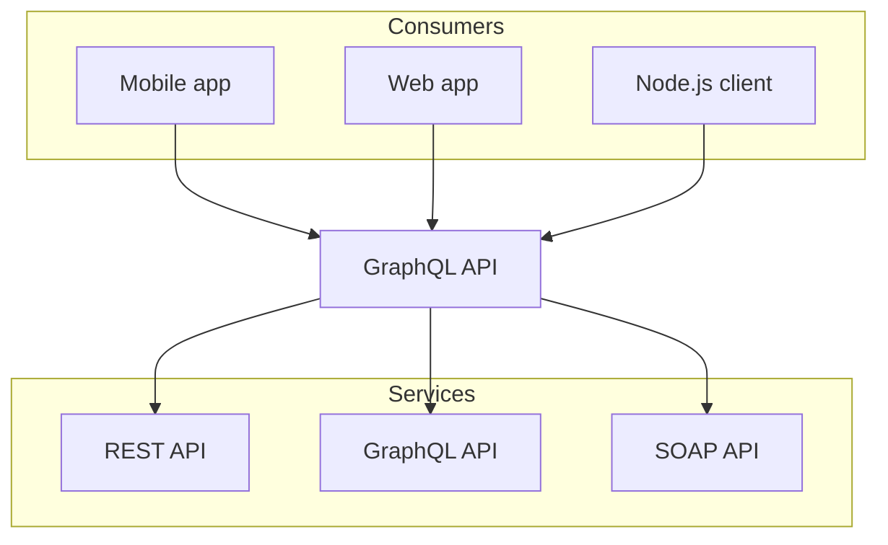

import { Cards, Steps } from 'nextra/components'
import { SiMarkdown, SiYaml, SiJson, SiJavascript, SiReact } from 'react-icons/si'
import { HiOutlineSparkles } from 'react-icons/hi2'

# Why MDX?

MDX brings together unstructured content via Markdown, typed schemas via JSON-LD, structured data via YAML frontmatter,
executable code via JavaScript/TypeScript, and UI components via JSX/React.

<Cards num={5}>
  <Cards.Card icon={<HiOutlineSparkles />} title='Generative AI' href='#generative-ai'/>
  <Cards.Card icon={<SiMarkdown />} title='Markdown' href='#markdown'/>
  <Cards.Card icon={<SiYaml />} title='YAML' href='#yaml'/>
  <Cards.Card icon={<SiJson />} title='JSON-LD' href='#json-ld'/>
  <Cards.Card icon={<SiJavascript />} title='Javascript / Typescript' href='#javascript-typescript'/>
  <Cards.Card icon={<SiReact />} title='JSX / React' href='#jsx-react'/>
</Cards>
<Steps>

### Functions

Functions are the building blocks of AI Primitives. They are small, reusable pieces of code that can be used to perform specific tasks.

### Workflows

Workflows are the building blocks of AI Primitives. They are small, reusable pieces of code that can be used to perform specific tasks.

### Agents

Agents are the building blocks of AI Primitives. They are small, reusable pieces of code that can be used to perform specific tasks.

</Steps>

